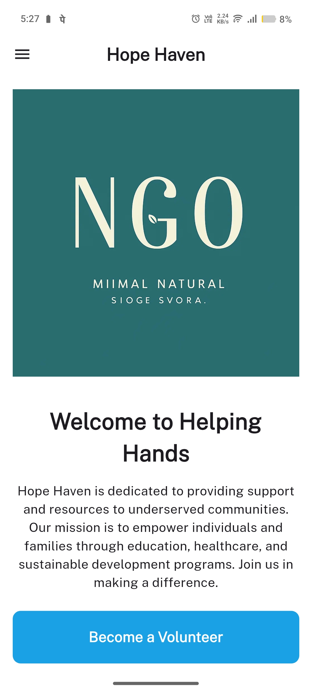
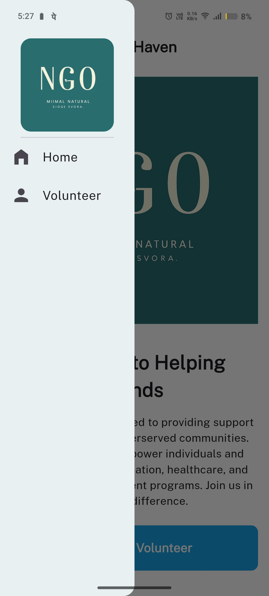
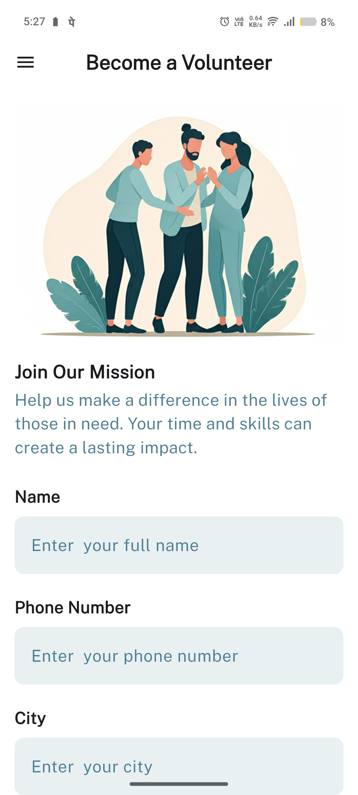
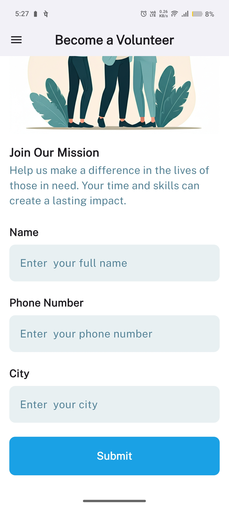
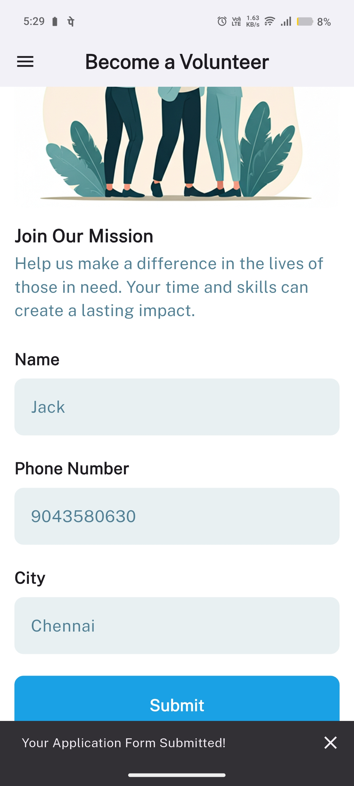
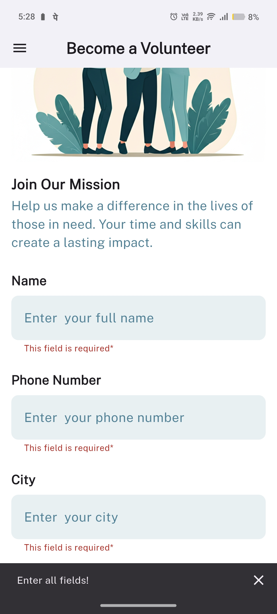

🕊️ Hope Haven – NGO Volunteer App
A simple and clean cross-platform mobile app built using Flutter to support an NGO in onboarding new volunteers.

📱 Features
1. Home Page
Displays NGO logo using Image.asset() or Image.network()
Includes a welcome message and a brief description of the NGO’s mission
Clean layout with a responsive and mobile-friendly design

2. Volunteer Form Page
Collects volunteer information:
Name
Phone Number (with number keyboard)
City
All fields are required and validated
On successful submission, shows a confirmation SnackBar
On error, displays inline field errors and prompts the user

3. Navigation
Implemented using a Drawer
Drawer includes navigation to:
🏠 Home
👥 Volunteer Form

🛠️ Technologies Used
Flutter
Dart

## 📸 Screenshots

### 🏠 Home Page

  

---

### 📂 Navigation Drawer

  

---

### 📋 Volunteer Form

<table>
  <tr>
    <td align="center">
       
      <b>Form - Empty</b>
    </td>
    <td align="center">
       
      <b>Form - Filled</b>
    </td>
  </tr>
</table>

---

### ✅ Validation & Submission

<table>
  <tr>
    <td align="center">
       
      <b>Form Submitted</b>
    </td>
    <td align="center">
       
      <b>Validation Error</b>
    </td>
  </tr>
</table>

🚀 How to Run
Make sure Flutter is installed:
https://docs.flutter.dev/get-started/install

Clone the repository or download the project folder

In terminal:
flutter pub get
flutter run
